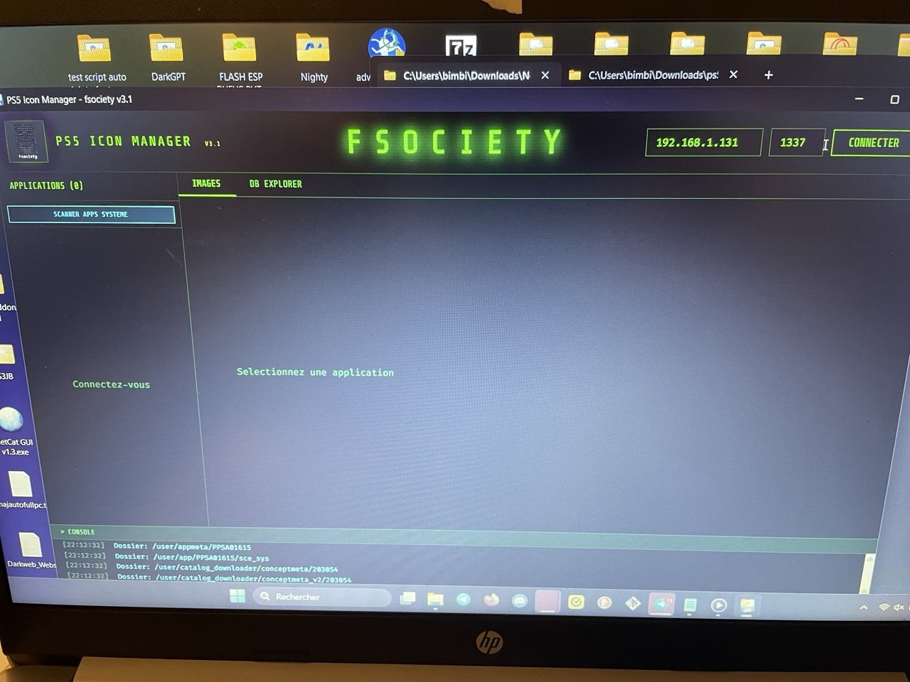
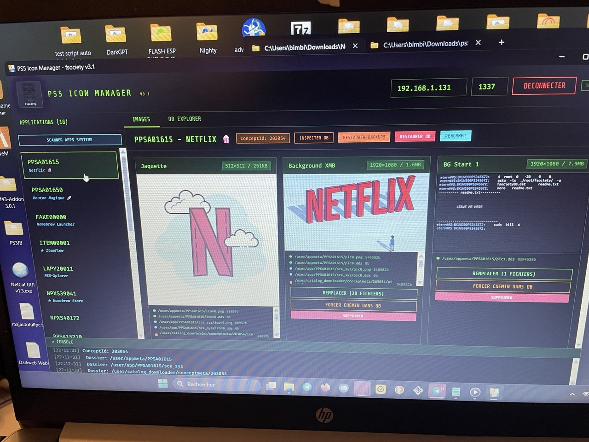
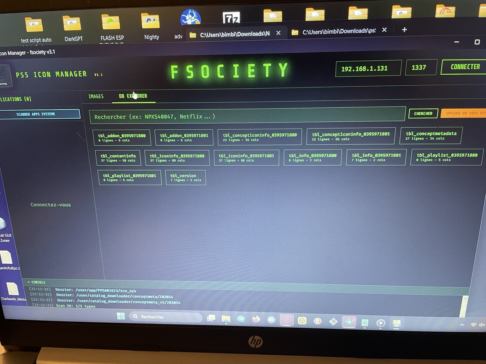
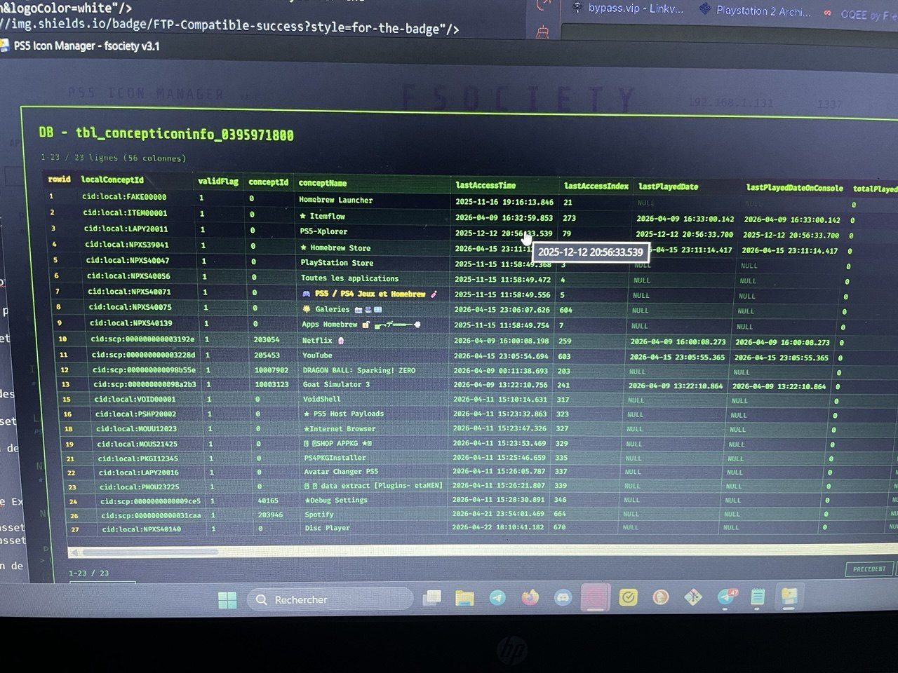
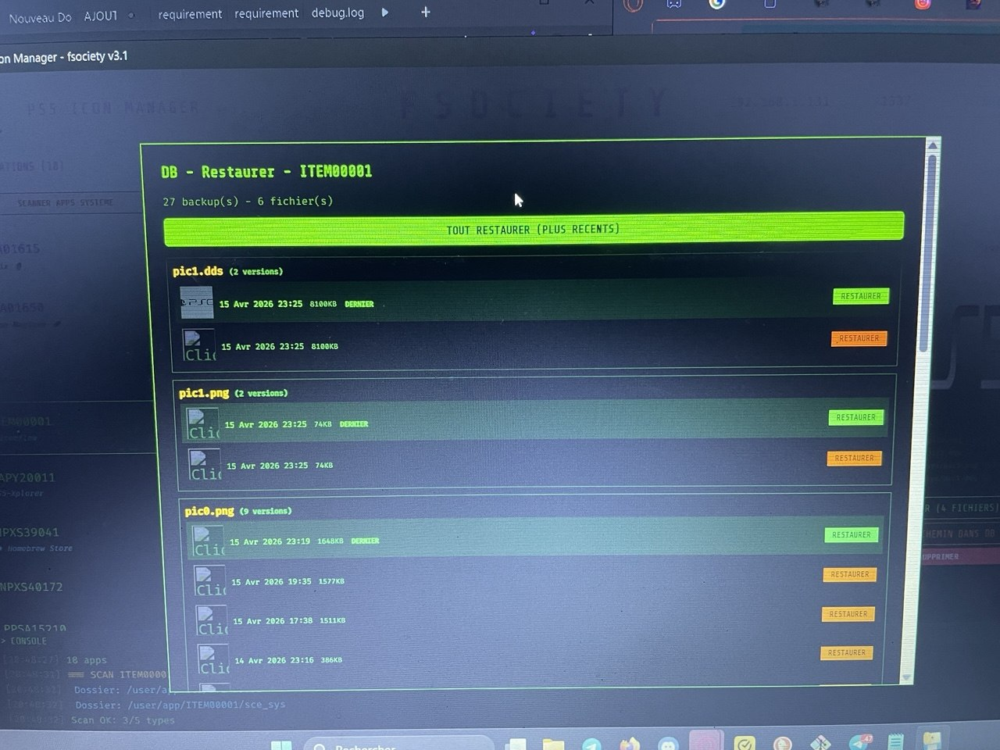
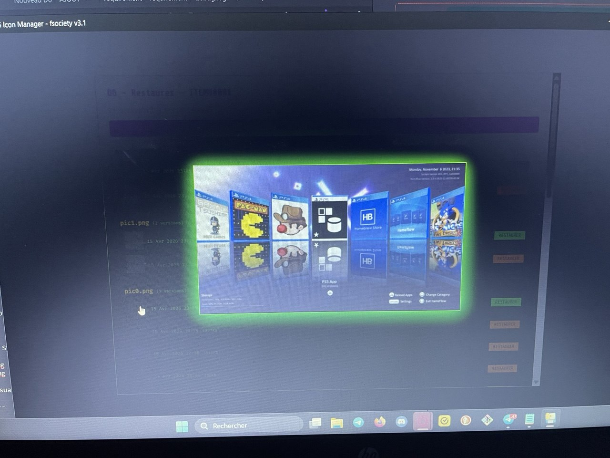

# 🎮 PS5 Icon Manager

Outil permettant de modifier les icônes, backgrounds et éléments visuels des jeux et des applications système PS5 directement depuis votre PC.

Un tool simple qui automatise la customisation visuelle de l'interface PS5.

 

---

# 🎥 Démonstration

👉 Clique sur l’image pour voir la vidéo

---

# 🖼️ Screenshots

### Interface principale

---

### Gestion des icônes et backgrounds (jeux et applications )

Modification des icônes des jeux... et des applications directement depuis l'interface.

---

### Database Explorer

Exploration de la base de données SQLite utilisée par le tool.

---

### Système de preview des backups

Visualisation des backups directement dans l’interface avant restauration.

---

# 🚀 À propos

PS5 Icon Manager est un outil conçu pour simplifier la modification des éléments visuels de la PlayStation 5.

Le programme permet notamment de modifier :

- les icônes des jeux
- les icônes des applications système
- les backgrounds
- certains visuels du XMB
- les images de savedata (fonctionnalité a terminer )

Le tool automatise entièrement le processus de modification.

Aucune manipulation manuelle des fichiers via FTP n’est nécessaire.

---

# 🎮 Fonctionnalités principales

## 🎨 Customisation visuelle

Le tool permet de modifier différents éléments visuels :

- Icônes des jeux
- Icônes des applications système
- Backgrounds
- Images de démarrage
- Renommage des applications

Le programme gère automatiquement :

- conversion des images
- redimensionnement
- placement automatique des fichiers
- création de backups
- restauration des images originales
- IP conservée entre session
---

## 🔎 Scanner d’applications

Le tool détecte automatiquement les applications installées.

Lors du scan, les informations suivantes sont affichées :

- identifiant CUSA / PPSA...
- nom réel de l'application
- assets disponibles

Les applications apparaissent directement dans la sidebar pour un accès rapide.

---

## 🧩 Gestion des icônes XMB

Le tool permet de masquer ou afficher certaines icônes du XMB (applications système).

Exemples :

- PlayStation Store
- PlayStation Plus
- autres icônes système

Cela permet d'obtenir une interface XMB plus propre et personnalisée.

---

## 💾 Système de backups

Avant toute modification, le tool crée automatiquement un backup.

Fonctionnalités :

- backup automatique des images originales
- preview des backups directement dans l’interface
- restauration sélective possible
- nettoyage automatique des anciens backups

Limitation :

- maximum 5 backups par fichier
- suppression automatique des anciens backups

## 💾 Système de backups Db

                           - Créer une backup automatique au démarrage 
                           - Bouton restaurer Db pour restaurer Db

---

## 🔐 Gestion automatique des permissions

Lors du remplacement des fichiers, le tool gère automatiquement les permissions.

Processus :

1. passage temporaire en 777
2. modification du fichier
3. remise automatique en 444

Cela permet d’éviter toute modification involontaire après remplacement.

---

## 🗄️ Base de données SQLite

Le tool utilise une base de données SQLite interne.

Fonctionnalités :

- stockage des informations d'applications
- inspection de la database
- database explorer intégré
- sauvegarde possible

---

# 🆕 Nouveautés (Version 3.1)

Améliorations récentes :

- ajout de nouvelles applications système détectées
- possibilité de masquer ou afficher certaines icônes du XMB
- affichage du nom des applications dans la sidebar
- affichage du nom réel des applications lors du scan
- ajout d’un système de preview des backups
- limitation automatique des backups à 3 versions
 - suppression automatique des anciens backups
- Correction d’un bug où plusieurs scans pouvaient se chevaucher et afficher des résultats incorrects.
Chaque nouveau scan annule désormais le scan précédent afin d’éviter les conflits d’affichage entre applications (jeu / système).

---

# ⚙️ Fonctionnement

Le fonctionnement du tool est simple :

1. connexion FTP à la PS5
2. scan des applications installées
3. détection des assets disponibles
4. modification des images
5. création automatique des backups
6. remplacement sécurisé des fichiers

---

# 📦 Installation

Deux méthodes sont disponibles.

---

## Méthode 1 — Exécutable (recommandé)

1. télécharger la dernière version dans Releases
2. extraire l’archive
3. lancer l’exécutable

Aucune installation de Python n'est nécessaire.

---

## Méthode 2 — Version Python

Prérequis :

- Python 3.11 ou 3.12

Lancer simplement :

python main.py , les dépendances s'installe.

L’interface web démarre automatiquement.

---

# 🎨 Outils recommandés pour modifier les images

Pour éditer les images vous pouvez utiliser :

GIMP  
https://www.gimp.org/downloads/

Paint.NET  
https://www.getpaint.net

---

# ⚠️ Disclaimer

Ce projet est encore en développement.

Même si aucun problème majeur n’a été rencontré lors des tests, des bugs peuvent toujours exister.

Utilisation à vos risques.

Il est recommandé de toujours conserver des backups.

---

# 🧠 Objectif du projet

Le but de ce projet est de simplifier la personnalisation visuelle de la PS5.

De nombreuses modifications nécessitent normalement des manipulations manuelles via FTP.

PS5 Icon Manager automatise ces opérations grâce à une interface simple.

---

# ⭐ Support

Si le projet vous plaît, vous pouvez soutenir le projet en laissant une ⭐ sur Git
